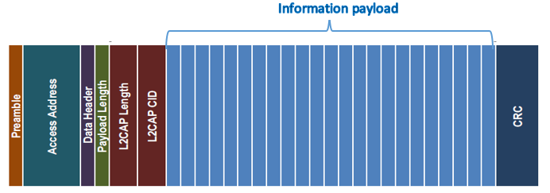

## 前言

上一篇文件分析了`DA14531`从收包中断开始一直到`L2CAP`层的数据包处理过程，最近又抽了一点时间将L2CAP层和`ATT`层收包的过程梳理了一遍，本文将结合BLE的协议规范和代码介绍`ATT`层的报文解析流程，并介绍一下分析过程中发现的一些漏洞。


## 回顾

从上文可知 `hci_acl_data_rx_handler` 用于处理L2CAP的报文，该函数首先会调用 `l2cc_pdu_unpack`  对L2CAP的头部字段进行简单的检查，其实就是检查`Length`和`Channel ID`是否合法


然后将`L2CAP`的报文拷贝到新分配的内存，最后根据数据包的类型通过消息机制将数据交给`sub_7F135F6` 或者 `l2cc_pdu_recv_ind_handler`处理，其中`sub_7F135F6`用于处理`ATT`报文。


## ATT层报文解析

首先我们看一下BLE协议规范中对 `ATT` 层的报文格式的定义，下图是一个`L2CAP`的蓝牙包的示意图



蓝牙协议的数据包分了好几个部分，其中 `ATT` 层的报文就位于图中的Information payload部分，sub_7F135F6就是在解析Information payload。

我们看看函数定义

```
int  sub_7F135F6(int id, l2cc_pdu_recv_ind *l2cc_pdu_recv, unsigned int dest_task)
```

其中l2cc_pdu_recv_ind是一个比较复杂的结构体，其使用了`union`来统一表示 L2CAP 里面的各种不同类型的Payload.

```
struct l2cc_pdu_recv_ind
{
    uint8_t status;
    // 表示数据的大小
    uint16_t rem_len;
    /// Offset
    uint16_t offset;
    /// 指向具体的数据
    struct l2cc_pdu pdu;
};
```

l2cc_pdu 用于表示L2CAP层的报文格式

```
struct l2cc_pdu
{
    /// L2Cap Payload Length
    uint16_t payld_len;
    /// L2Cap Channel ID
    uint16_t chan_id;

    /// Data PDU definition
    union l2cc_pdu_data
    {
        /// L2Cap packet code.
        uint8_t code;

        struct l2cc_lecb_send_data_req send_lecb_data_req;
        struct l2cc_reject           reject;
        struct l2cc_update_param_req update_req;
        .............................
        .............................
    }
}
```

可以看到和L2CAP的报文格式完全匹配，开头4字节是 Length 和 Channel ID，其中 Length 在`hci_acl_data_rx_handler`函数中经过检查，表示后面Information payload部分的长度。

`Information payload`采用联合体的方式定义，根据不同的code来选择不同的结构体定义进行表示。

ATT PDU格式如下


由图可知，ATT PDU由**一个字节的`opcode`和变长的数据**组成。

下面以 l2cc_att_err_rsp 为例

```
/// Error response
struct l2cc_att_err_rsp
{
    /// Error Response - 0x01
    uint8_t     code;
    /// The request that generated this error response
    uint8_t     op_code;
    /// The attribute handle that generated this error response
    uint16_t    handle;
    ///The reason why the request has generated an error response
    uint8_t     reason;
};
```

可以看到Error response 的 ATT PDU的组成为

1. 1字节的code
2. 1字节的op_code
3. 2字节的handle
4. 1字节的reason

然后去翻看BLE规范中的定义发现完全符合


经过简单的浏览发现SDK中对于每种PDU的格式定义要比BLE规范中的更详细。

下面从代码角度开始分析，关键代码如下

```
int sub_7F135F6(int id, l2cc_pdu_recv_ind *l2cc_pdu_recv, unsigned int dest_task)
{
    ret = atts_l2cc_pdu_recv_handler(dest_task >> 8, l2cc_pdu_recv);
    if ( ret == 255 )
    {
        ret = attc_l2cc_pdu_recv_handler(dest_task >> 8, l2cc_pdu_recv);

```

函数主要逻辑就是首先调用`atts_l2cc_pdu_recv_handler`尝试对数据进行解析，如果函数返回值为`255`就尝试调用`attc_l2cc_pdu_recv_handler`进行解析。

atts_l2cc_pdu_recv_handler 和 attc_l2cc_pdu_recv_handler 实际就是根据ATT PDU 的 opcode 字段在atts_handlers 和 attc_handlers两个结构体数组中搜索到opcode对应的回调函数，其结构体定义如下

```
struct att_handler_item
{
  unsigned __int8 code; // 表示 ATT PDU 的 opcode
  unsigned __int8 d[3];
  dummy_func func;  // 函数指针
};
```

其中func的第二个参数就指向了 `ATT PDU` 的开头，搜索 `opcode` 对应处理函数的代码如下

```
  for ( i = 0; i < 0xE; i = (i + 1) )
  {
    if ( atts_handlers_0_0[i].code == code )
    {
      func = atts_handlers_0_0[i].func;
    }
  }
  if ( func )
  {
    result = (func)(dest_id, &l2cc_pdu_recv->pdu.data);
```

atts_handlers 和 attc_handlers的定义如下


我们以`attc_handlers`的第一项为例介绍分析`ATT PDU`解析代码的流程，可以看的第一项的定义为

```
att_handler_item <3, 0, sub_7F0FC0C+1>
```

即这里处理的code为3，回调函数为sub_7F0FC0C，去BLE手册中查找发现code为3表示的是Exchange MTU Response类型的PDU，其定义如下


然后可以去SDK中找到该PDU的结构体定义

```
/// Exchange MTU Response
struct l2cc_att_mtu_rsp
{
    /// Exchange MTU Response - 0x03
    uint8_t     code;
    /// Server Rx MTU size
    uint16_t    mtu_size;
};
```

然后我们去看 `sub_7F0FC0C` 的实现

```
int sub_7F0FC0C(int dest_id, l2cc_att_mtu_rsp *payload)
{

  mtu_size = gattm_get_max_mtu();
  if ( mtu_size >= payload->mtu_size )
  {
    mtu_size = payload->mtu_size;
  }
  gattc_set_mtu(dest_id, mtu_size);
  if ( gattc_get_operation(dest_id, 1) == 1 )
  {
    v5 = 0;
  }
  else
  {
    v5 = 65;
  }
  gattc_send_complete_evt(dest_id, 1, v5);
  return 0;
}
```

可以看的主要就是从`payload`里面取出`mtu_size`，然后和当前的`mtu`进行比较，最后会设置新的`mtu`。我们可以采用这种方式去分析其他ATT PDU的处理逻辑。

## 漏洞挖掘

梳理清楚ATT PDU的处理流程后，我们就可以逐个地分析固件中对每个ATT PDU的代码实现，然后从中发现漏洞，为了效率我们可以去分析每种PDU的定义，然后可以优先去查看结构体定义中带有变长成员、以及Length、offset这类敏感词的PDU处理逻辑，因为漏洞主要就处在处理变长数据的地方，比如

```
/// Find Information Response
struct l2cc_att_find_info_rsp
{
    /// Find Information Response - 0x05
    uint8_t     code;
    /// The format of the information data.
    uint8_t     format;
    /// Data length
    uint16_t    data_len;
    ///The information data whose format is determined by the Format field
    uint8_t     data[__ARRAY_EMPTY];
};
```


### l2cc_att_rd_by_type_rsp 整数溢出导致堆溢出

sub_7F0FDB4函数用于处理 `Read By Type Response` 类型的PDU，关键代码如下

```
int __fastcall sub_7F0FDB4(int id, l2cc_att_rd_by_type_rsp *payload)
{

  operation = gattc_get_operation(id, 1);

  if ( operation != 10 )
  {
    gattc_send_complete_evt(id, 1, v5);
    return v30;
  }

  if ( gattc_get_mtu(id) - 2 > payload->each_len )
  {
    msg = ke_msg_alloc(dword_7F102F0 + 4, v23, src_id, payload->each_len + 4);
    *msg = (payload->data[1] << 8) | payload->data[0];
    sub_len = (payload->each_len - 2);
    *(msg + 4) = sub_len;
    *(msg + 2) = 0;
    qmemcpy((msg + 6), &payload->data[2], sub_len); // 整数溢出
    ke_msg_send(msg);
  }

}
```

如果operation为0，就会最后一个if分支，然后会判断 `payload->each_len` 小于 `gattc_get_mtu(id) - 2`  就会去根据 `each_len` 分配内存，然后对 `each_len - 2` 保存到`sub_len`，最后拷贝`sub_len`个字节的数据到新分配的内存msg里面。

如果 `sub_len` 为 1，`msg`可用内存空间就是 `5`， 然后 `sub_len` 会由于整数溢出导致值为 `0xFFFF` ，然后进行`memcpy`时就会导致堆溢出。


### ATT PDU处理函数多处越界读

ATT PDU处理函数中，很多都没有考虑输入数据的长度，直接去访问，如果输入数据长度小于访问的大小的话就会导致越界读，本节就介绍几个典型的例子

比如sub_7F1015C

```
int __fastcall sub_7F1015C(int a1, l2cc_att_rd_rsp *payload)
{

  v4 = gattc_get_operation(a1, 1);
  if ( v4 == 4 )
  {
    v6 = gattc_get_operation_ptr(a1, 1);
    v7 = co_list_pop_front((off_7F102F4[a1] + 12));
    qmemcpy(&v7[5].next + 3, payload->value, 0x10u);  // 直接拷贝， 越界读
```

这里直接从 payload->value部分拷贝0x10字节，没有检查payload的实际长度，当payload剩余长度比较小（小于0x10）就会导致越界读。

这个例子是没有校验的，下面看一个校验失败的

```
void sub_7F11E24(int id, l2cc_att_rd_mult_req *payload)
{

  v2 = 0;
  v4 = co_list_size((_DWORD **)off_7F11FAC[id] + 24);
  p_payload_length = (int)(payload - 1); 获取 &l2cc_pdu->payld_len
  if ( !*p_payload_length )
  {
    *p_payload_length = gattc_get_mtu(v19) - 1;
  }
  while ( payload->nb_handles > v4 && *p_payload_length )
  {
    if ( v2 )
    {
      goto LABEL_13;
    }
    data = (int)payload + 2 * v4;
    v2 = sub_7F1126C(v19, 0, *(unsigned __int16 *)(data + 4), (int)v16);
  }

```

函数首先根据 `payload - 1` 可以获取到 `l2cc_pdu` 的开头，然后去访问 `l2cc_pdu` 里面的 `payld_len` 就可以得到`payload`的长度（`p_payload_length`）。

```
struct l2cc_pdu
{
    /// L2Cap Payload Length
    uint16_t payld_len;
    /// L2Cap Channel ID
    uint16_t chan_id;
```

但是后续代码只检查 `p_payload_length` 的值是否为0，假设 `p_payload_length`  为 1，就会进入循环，然后根据 `v4` 计算 `data` 的地址，然后去访问，这时就会导致越界读。


## 其他

没事干在SDK里面瞎浏览的时候发现gattc_write_req_ind_handler这个函数，然后在google上浏览发现该函数应该是用于处理GATT协议栈的某种报文的，然后在SDK中搜索gattc_write_req_ind_handler的引用

```
const struct ke_msg_handler pasps_default_state[] =
{
    {GATTC_WRITE_REQ_IND,           (ke_msg_func_t) gattc_write_req_ind_handler},
};
```

可以看到gattc_write_req_ind_handler对应的消息ID为 GATTC_WRITE_REQ_IND（值为 0xC15），然后继续搜索GATTC_WRITE_REQ_IND看看是谁会发送该消息，不过在SDK源码中没有找到，应该是在ROM中的固件会发送该消息，我们可以使用 [之前的脚本](https://github.com/hac425xxx/BLE-DA145XX/blob/main/argument_tracker.py#L658) 把所有的msg id 使用情况导出到文件，然后在文件中搜索该消息ID, 0xC15，最后找到位于`0x7f114dc`的函数会调用发送该消息

```
void __fastcall caller_gattc_write_req_ind(int a1, const void *value, size_t length, uint16_t offset, uint16_t handle, char a6)
{

  msg = ke_msg_alloc(0xc15, v8, (a1 << 8) + 8, length + 6);
  msg->handle = handle;
  v10 = msg;
  msg->length = length;
  msg->offset = offset;
  qmemcpy(msg->value, value, length);
  ke_msg_send(v10);

```

主要就是把入参的value、length和offset通过消息发送出去，其中 length表示 value的长度，跟踪该函数的交叉引用，可以发现其中一条路径是 0x52 类型的 ATT PDU的会调函数调用

```
sub_7F11F42
	caller_gattc_write_req_ind
```

0x52的结构体定义如下

```
/// Write Command
struct l2cc_att_wr_cmd
{
    /// Write Command - 0x52
    uint8_t     code;
    /// The handle of the attribute to be written
    uint16_t    handle;
    /// Value length
    uint16_t    value_len;
    /// The value to be written to the attribute
    uint8_t     value[__ARRAY_EMPTY];
};
```

`sub_7F11F42` 函数关键代码

```
void __fastcall sub_7F11F42(int a1, l2cc_att_wr_cmd *payload)
{

  if ( !get_elem_by_handle(a1, 2, payload->handle, elem) 
  && !verify_value_len(elem, payload->value_len, 0, v4) )
  {
    caller_gattc_write_req_ind(a1, payload->value, payload->value_len, 0, payload->handle, 82);
  }
```

首先根据`handle`找到对应的元素，然后检查`value_len`不能超过`elem`的最大长度，最后就会通过`caller_gattc_write_req_ind`把数据发送到`gattc_write_req_ind_handler`进行后续处理。

在SDK中搜索 `gattc_write_req_ind_handler` 可以发现该函数有多个实现，猜测是针对不同的场景，用户可以重写该函数实现特定的功能，使用 [search_msg_handler.py](https://github.com/hac425xxx/BLE-DA145XX/blob/main/search_msg_handler.py#L97) 搜索 0xC15 消息回调函数，也可以在固件中找到一些实现，其中部分可以和SDK的源码对应。

通过分析这个流程，我们可以从  `gattc_write_req_ind_handler`  开始一些漏洞挖掘，不过由于这部分在SDK中有源码，所以审计起来会轻松不少。


## 参考链接

```
https://www.cnblogs.com/iini/p/8977806.html  详解BLE空口包格式—兼BLE Link layer协议解析
https://tw511.com/a/01/14340.html
```


