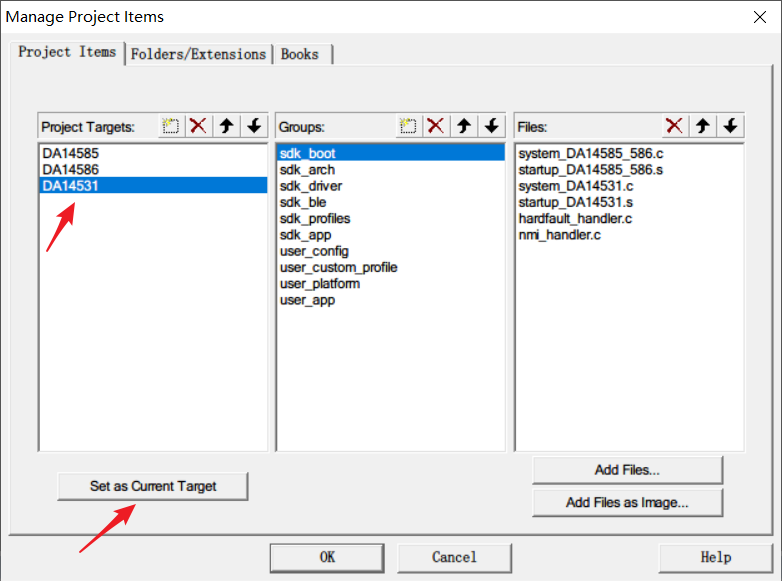
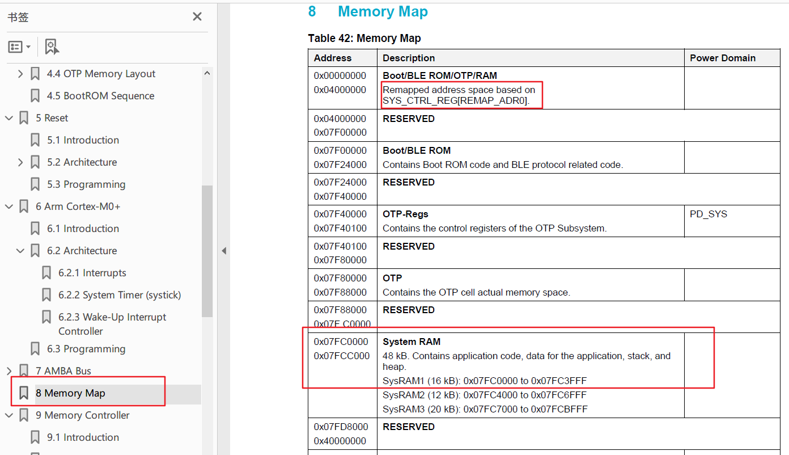
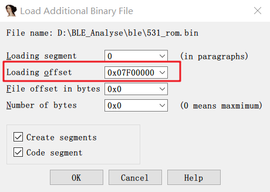

## 前言

本文介绍逆向`DA14531`芯片的固件，并介绍一些辅助自动化分析的脚本的实现。`DA14531`是Dialog公司研制的蓝牙芯片，用户可以在官网下载SDK来开发蓝牙的上层业务。

## SDK环境搭建和IDA加载固件

下载SDK后，进入其中一个示例项目

```
DA145xx_SDK\6.0.14.1114\projects\target_apps\ble_examples\ble_app_profile\Keil_5
```

使用Keil打开，然后选择 `Project->Manage->Component`，设置目标为`DA14531`.



然后编译之后就会下面的目录生成编译好的固件

```
DA145xx_SDK\6.0.14.1114\projects\target_apps\ble_examples\ble_app_profile\Keil_5\out_DA14531\Objects
```

其中比较关键的几个文件有

```
ble_app_profile_531.axf: 工程文件编译为ELF文件
ble_app_profile_531.bin: 可以直接刷入系统RAM的二进制
ble_app_profile_531.hex: hex文件格式，相比.bin文件该文件中带有刷入的地址
```

其中 `.axf` 其实就是ELF文件，里面有符号信息和加载基地址等，`.bin`文件可以直接写入到芯片的固定地址，查看芯片手册中的`Memory Map`部分



可以猜测`.bin`文件的基地址为`0x7fc0000`，这点也可以通过用IDA分析`.axf` 文件得到证明，下面为了简化分析流程，直接用IDA分析`ble_app_profile_531.axf`.

随便打开一些函数分析，发现有的函数会直接将某些没有加载到内存的地址作为函数进行调用，比如

```
int __fastcall gattc_write_req_ind_handler()
{
  v6 = MEMORY[0x7F22448](param->handle, att_idx); // 将 0x7F22448 作为函数进行调用
```

查看芯片手册可以知道这块地址的描述为

```
Boot/BLE ROM
Contains Boot ROM code and BLE protocol related code.
```

可以知道这块内存里面应该有一些协议栈底层的代码，而且翻看SDK的代码发现很多系统的函数都没有源码，在编译出来后的二进制里面也没有对应函数的实现，猜测这部分函数的实现也在这个区域中。

最后让群友帮忙在开发板里面用`jtag`把这块内存`dump`了下来，然后咱们加载到`IDA`中

```
File -> Load file -> Additional binary file
```

选择`dump`出来的二进制文件，然后设置加载地址为 `0x7fc0000` 。



加载完后，这些函数调用就可以正常识别了。

## 加载函数符号

对部分函数分析一段时间后，在搜索SDK的时候，忽然发现了一个比较神奇的文件

```
da14531_symbols.txt
```

文件的部分内容如下

```
0x07f2270b T custs1_set_ccc_value
0x07f22823 T gattc_cmp_evt_handler
0x07f22837 T custs1_val_set_req_handler
0x07f22857 T custs1_val_ntf_req_handler
0x07f228b3 T custs1_val_ind_req_handler
0x07f2290f T custs1_att_info_rsp_handler
0x07f2294b T gattc_read_req_ind_handler
0x07f22b57 T gattc_att_info_req_ind_handler
0x07f22b99 T custs1_value_req_rsp_handler
```

看起来好像是一个列是符号内存地址，第三列是符号名，后面去网上搜索这个文件的作用，发现是keil支持的一种输入文件，用于在链接的时候把符号引用替换为对应的内存地址地址，这样在固件运行时就可以正常调用函数，这样也可以让一部分代码不开源。

最后写了个`idapython`脚本加载这个符号文件

```
import idaapi
import idc

fpath = "da14531_symbols.txt"

def define_func(addr, name):
    if addr & 1:
        addr -= 1
        idaapi.split_sreg_range(addr, idaapi.str2reg("T"), 1, idaapi.SR_user)
    else:
        idaapi.split_sreg_range(addr, idaapi.str2reg("T"), 0, idaapi.SR_user)
    
    if idaapi.create_insn(addr):
        idc.add_func(addr)
        idaapi.set_name(addr, name,idaapi.SN_FORCE)
        

def define_data(addr, name):
    idaapi.set_name(addr, name,idaapi.SN_FORCE)
    
with open(fpath, "r") as fp:
    for l in fp:
        try:
            addr, type, name = l.strip().split(" ")
            if addr.startswith(";"):
                continue
            addr = int(addr, 16)
            if type == "T":
                define_func(addr, name)
            else:
                define_data(addr, name)
        except:
            pass
```

1. 主要逻辑就是一行一行的处理文件，丢弃 `;` 开头的行
2. 然后根据第二列的值来进行对应的处理
3. 如果是`T`表示这个符号是一个函数地址调用`define_func`处理，否则就当做变量符号调用`define_data`处理

主要提一下的就是在处理函数的时候的代码

```
def define_func(addr, name):
    if addr & 1:
        addr -= 1
        idaapi.split_sreg_range(addr, idaapi.str2reg("T"), 1, idaapi.SR_user)
    else:
        idaapi.split_sreg_range(addr, idaapi.str2reg("T"), 0, idaapi.SR_user)
    
    if idaapi.create_insn(addr):
        idc.add_func(addr)
        idaapi.set_name(addr, name,idaapi.SN_FORCE)
```

1. 首先需要根据地址的最低位是否为1来判断是否为thumb指令，然后根据情况设置`idaapi.str2reg("T")` 寄存器的值，IDA会根据这个寄存器的值来判断后面反汇编指令时采用的是`thumb`指令还是`arm`指令
2. 然后调用`idaapi.create_insn`让`ida`从函数地址处开始进行反汇编并创建指令
3. 指令创建成功之后就调用`idc.add_func`创建一个函数并使用`idaapi.set_name`设置函数的名称

执行脚本后很多的系统函数都识别出来了。


## 操作系统任务识别

### 创建任务API分析

分析嵌入式系统，首先需要将系统中存在的**task/进程**识别出来，经过一番的资料查找和SDK学习，可以知道`DA145x`芯片中的操作系统为Riviera Waves实时系统，该系统使用用`ke_task_create`来创建一个任务，从SDK中可以获取函数的定义如下

```
/**
 ****************************************************************************************
 * @brief Create a task.
 *
 * @param[in]  task_type       Task type.
 * @param[in]  p_task_desc     Pointer to task descriptor.
 *
 * @return                     Status
 ****************************************************************************************
 */
uint8_t ke_task_create(uint8_t task_type, struct ke_task_desc const * p_task_desc);
```

可以看到函数两个参数，第一个表示任务的类型，第二个参数为`ke_task_desc`结构体指针，表示任务的描述信息。

如果需要识别所有的任务，就可以通过查找 `ke_task_create` 的交叉引用，然后获取函数调用的两个参数即可拿到任务的类型和对应的任务描述符地址，然后再解析`ke_task_desc`就可以获取到每个任务的具体信息。

为了自动化的实现该目标，需要一个能在IDA中获取函数调用参数值的脚本，下面首先分析此脚本的实现

### 函数调用参数识别脚本

脚本地址

```
https://github.com/hac425xxx/BLE-DA145XX/blob/main/argument_tracker.py
```

参数追踪主要在`ArgumentTracker`类中实现，脚本实现了两种参数识别的方式分别为**基于汇编指令和模拟执行的函数调用参数识别 **， **基于IDA伪代码的函数调用参数识别**。

下面分别对其实现进行介绍

#### 基于汇编指令和模拟执行的函数调用参数识别

这种方法由 `reobjc` 脚本演变而来

```
https://github.com/duo-labs/idapython/blob/master/reobjc.py
```

功能实现于`track_register`函数，主要思路是：

1. 追踪存储函数参数的**寄存器/内存地址**的使用，做一个类似污点分析的功能，直到找到最初赋值的位置（比如`ldr`, `mov`)
2. 然后从赋值点开始使用`unicorn`模拟执行，一直执行到函数调用的位置
3. 然后从`unicorn`获取此时的对应寄存器和内存的值就可以得到具体的函数参数值

示例：

```
rom_ble:07F09CC0                 LDR             R1, =0x7F1F550
rom_ble:07F09CC2                 MOVS            R0, #0  ; task_type
rom_ble:07F09CC4                 ADDS            R1, #0x28 ; '(' ; p_task_desc
rom_ble:07F09CC6                 BL              ke_task_create
```

假设现在需要追踪**参数二**（即`R1`）的值，步骤如下：

1. 首先从`07F09CC6`往前搜索`R1`的赋值点，发现 `07F09CC4` 这里是一条ADD指令不是最初赋值点，继续往上搜索
2. 最后找到`07F09CC0`这里是`LDR`指令
3. 然后使用`unicron`从`07F09CC0`开始执行，一直执行到`07F09CC6`即可获取到在调用`ke_task_create`时**参数二（即`R1`）的值**

下面看看关键的代码

```
        while curr_ea != idc.BADADDR:
            mnem = idc.print_insn_mnem(curr_ea).lower()
            dst = idc.print_operand(curr_ea, 0).lower()
            src = idc.print_operand(curr_ea, 1).lower()

            if dst == target and self.is_set_argument_instr(mnem):
                target = src
                target_value = src
                target_ea = curr_ea
                if target.startswith("="):
                    break

            if dst == target == "r0" and self.is_call_instr(mnem):
                previous_call = curr_ea
                break
            curr_ea = idc.prev_head(curr_ea-1, f_start)
```

主要就是不断调用`idc.prev_head`往前解析指令，然后对每条指令进行分析，实现一个反向的污点跟踪，直到找到目标的赋值点为止，找到赋值点后就使用`Unicorn`去模拟执行

#### 基于IDA伪代码的函数调用参数识别

有的时候基于汇编指令向后做跟踪会丢失部分信息，示例：

```
if(cond1)
{
    v4 = 0x101
}

if(cod2)
{
    v4 = 0x303;
}

if(cod4)
{
    v4 = 0x202;
}

some_func(v4 - 1, 0)
```

对于这样的代码如果直接使用第一种方式实际只会得到 `v4 = 0x201`，会漏掉两种可能值。

为了缓解这种情况，实现了一个基于IDA伪代码的参数值识别脚本，功能实现于`decompile_tracer`函数。

其主要思路也是类似，首先定位需要获取的参数，然后提取参数字符串，分别跟踪参数的每个组成部分，找到赋值点，然后求出每个部分的值，从而得到参数的所有取值.

还是以上面的为例，假设需要获取参数1的值，处理流程如下

1. 首先提取得到参数1的组成部分为 `v4` 和 1，1为常量，只需要追踪`v4`
2. 然后往上追踪，找到`v4`的可能值为`0x202`， `0x303`， `0x101`
3. 最后得到`v4 - 1`的所有可能值为`0x201`， `0x302`， `0x100`

### 任务自动化识别

首先找到`ke_task_create`的交叉引用，然后利用`ArgumentTracker`中基于汇编的参数获取模式来提取参数的值

```
def dump_ke_task_create():
    retsult = {}
    logger = CustomLogger()
    m = CodeEmulator()
    at = ArgumentTracker()

    ke_task_create_addr = idaapi.get_name_ea(idaapi.BADADDR, "ke_task_create")
    for xref in XrefsTo(ke_task_create_addr, 0):
        frm_func = idc.get_func_name(xref.frm)
        ret = at.track_register(xref.frm, "r1")
        if ret.has_key("target_ea"):
            if m.emulate(ret['target_ea'], xref.frm):
                reg = m.mu.reg_read(UC_ARM_REG_R1)
                retsult[xref.frm] = reg
```

首先获取`ke_task_create`的地址，然后查找其交叉引用

1. 对于每个交叉引用使用`track_register`来追踪`r1`寄存器（即参数二）
2. `ret['target_ea']`表示赋值点，然后使用`CodeEmulator`从赋值点执行到函数调用的位置（`xref.frm`）
3. 执行成功后读取`r1`的值，即可得到任务描述符的地址

拿到任务描述符的地址后下面需要定义描述符的类型，首先看看`ke_task_desc`的定义

```
/// Task descriptor grouping all information required by the kernel for the scheduling.
struct ke_task_desc
{
    /// Pointer to the state handler table (one element for each state).
    const struct ke_state_handler* state_handler;
    /// Pointer to the default state handler (element parsed after the current state).
    const struct ke_state_handler* default_handler;
    /// Pointer to the state table (one element for each instance).
    ke_state_t* state;
    /// Maximum number of states in the task.
    uint16_t state_max;
    /// Maximum index of supported instances of the task.
    uint16_t idx_max;
};
```

这里主要关注`ke_state_handler`，该结构中有一个`msg_table`，里面是一些函数指针和其对应的消息`id`

```
/// Element of a message handler table.
struct ke_msg_handler
{
    /// Id of the handled message.
    ke_msg_id_t id;
    /// Pointer to the handler function for the msgid above.
    ke_msg_func_t func;
};

/// Element of a state handler table.
struct ke_state_handler
{
    /// Pointer to the message handler table of this state.
    const struct ke_msg_handler *msg_table;
    /// Number of messages handled in this state.
    uint16_t msg_cnt;
};
```

我们也就按照结构体定义使用相应的`IDApython`的接口即可（注意：使用`idapython`设置结构体前要确保对应的结构体已经导入到IDB中）

```

    for k, v in retsult.items():
        frm_func = idc.get_func_name(k)
        task_desc_ea = v
        task_desc_name = "{}_task_desc".format(frm_func.split("_init")[0])
        define_ke_task_desc(task_desc_ea, task_desc_name)

        handler = idaapi.get_dword(task_desc_ea + 4)
        define_ke_state_handler(handler)
```


## 识别消息和回调函数的交叉引用


