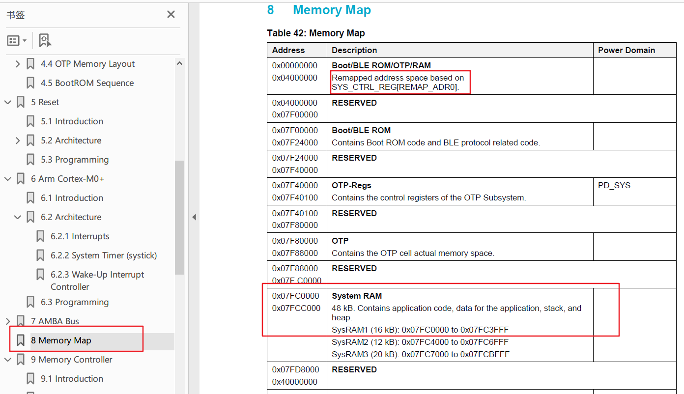

## 前言

本文介绍定位和分析`DA14531`收包流程的方法，并提供简单的BLE协议漏洞挖掘思路。

## 定位收包函数

通过查看`DA14531`的芯片手册，我们知道这个芯片使用的CPU是 `Arm Cortex-M0+`，我们知道`M0`的异常向量表位于0地址处，所以我们去看看`DA14531`手册的`memory map` 一节中是怎么定义0这个地址的。



可以看到地址空间 `[0, 0x4000000]` 的描述如下

```
Remapped address space based on SYS_CTRL_REG[REMAP_ADR0].
```

看意思感觉是**0地址**这块区域会根据`SYS_CTRL_REG[REMAP_ADR0]`的值被重新映射。

在手册中搜索`SYS_CTRL_REG`，可以找到`REMAP_ADR0`的定义

可以看到`REMAP_ADR0`的取值不同会把不同的区域重映射到0地址处，这里以值为 `0x2` 为例，此时会把`RAM` (`SysRAM1`)这块区域映射到**0地址**，查看memory map可以知道这款区域的详细信息

```
SysRAM1 (16 kB): 0x07FC0000 to 0x07FC3FFF
```

所以`0x07FC0000`开头就存放着异常向量表， 实际上开发者使用`DA14531`芯片的`SDK`编译出来的软件就是烧写在这个区域，自己编译一个软件，然后加载到IDA既可拿到异常向量表的信息


找到异常向量表后，可以去翻翻手册，看看`DA14531`使用的中断的类型和描述


可以看的 `IRQ #1` 的 `BLE_GEN_IRQn`中断感觉和蓝牙收发包相关，其中`LE_RX_IRQn`中断在每个数据包接收完毕后触发。

然后我们去异常向量表中找到 `IRQ #1` 的处理函数，由于M0芯片的内置异常为16个，所以 `IRQ #1` 的处理函数为`rwble_isr`。

## 收包流程分析

`rwble_isr`函数入口会对`40000xxx`的地址进行访问

```
void rwble_isr()
{
  if ( unk_40000200 << 31 )
  {
    unk_40000200 |= 2u;
  }
  if ( (unk_40000200 & 0x400000) != 0 )
  {
    unk_40000200 |= 0x400000u;
```

可以在`SDK`中搜索这些地址，拿到地址的信息，比如`0x40000200`地址处是蓝牙的控制寄存器

```
#define BLE_CNTL2_REG                        (0x40000200) /* BLE Control Register 2 */
```

逆向了一小会后发现`rwble_isr`函数的源码在`SDK`中，可以直接查看，和收包相关的代码如下

```
__BLEIRQ void rwble_isr(void)
{
    // Loop until no more interrupts have to be handled
    while (1)
    {
        // Check BLE interrupt status and call the appropriate handlers
        uint32_t irq_stat = ble_intstat_get();
        if (irq_stat == 0)
            break;
        // Rx interrupt
        if (irq_stat & BLE_RXINTSTAT_BIT)
        {
            DBG_SWDIAG(BLE_ISR, RXINT, 1);

            ble_intack_clear(BLE_RXINTSTAT_BIT);

            dlg_rx_isr();

            DBG_SWDIAG(BLE_ISR, RXINT, 0);
        }
```

函数首先调用`ble_intstat_get` 读取中断状态，然后根据`irq_stat`中的二进制位判断中断的类型（感觉和Linux的共享`IRQ`机制类似），如果有`BLE_RXINTSTAT_BIT`表示是收包中断，会调用 `dlg_rx_isr` 处理收包事件。

`dlg_rx_isr`函数实际调用的是`lld_evt_rx_isr`，`lld_evt_rx_isr` 会进入 `lld_evt_rx` 函数

```
void __fastcall lld_evt_rx(lld_evt_tag *elt)
{
  v1 = elt + 1;
  v2 = *(82 * LOWORD(elt[1].anchor_point.basetime_cnt) + *off_7F09820 + 0x114) >> 12;// ble_cntl_get
  add_evt_deferred_tag(elt, 0, v2);
  HIBYTE(v1->tx_prog.maxcnt) += v2;
  ke_event_set(5u);
}
```

主要就是触发 `#5` 号事件去完成具体的收包过程，该事件的回调函数在lld_evt_init中注册

```
int __fastcall lld_evt_init(int a1, int a2, int a3, int a4)
{
	...................
	...................
	return ke_event_callback_set(5u, lld_evt_deffered_elt_handler);
}
```

因此会进入`lld_evt_deffered_elt_handler`进行下一步数据包的处理，其主要代码如下

```
int lld_evt_deffered_elt_handler(int a1, int a2, int a3, int a4)
{
    ke_event_clear(5u);
    while ( 1 )
    {
    	// 取出packet的结构
        pkg_info = get_recv_pkg_info(&v11, &rx_cnt);

        // 0x200 的回调函数 0x7F0581B, 0x7F0CB37
        msg_data = ke_msg_alloc(0x200, dest_id, 2u, 6u);
        
        // 填充msg_data里面的数据包相关信息
        lld_data_rx_check((pkg_info_1 + 36), msg_data, rx_cnt);
        
        // 消息回调函数处理数据
        ke_msg_send(msg_data);                    
    }

    return pkg_info;
}
```

首先清除`#5`号事件，然后从全局链表中取出一个包的信息，然后发送一个 `msg_id` 为 `0x200` 消息，消息的`param`部分由 `lld_data_rx_check` 填充，`param`的结构体定义如下

```
struct lld_data_ind
{
    /// Handle of the first RX buffer
    uint8_t rx_hdl;
    /// Number of received buffers
    uint8_t rx_cnt;
    /// Number of transmitted data buffers
    uint8_t tx_cnt;
    /// Number of transmitted data control buffers
    uint8_t tx_cnt_cntl;
    /// Event counter
    uint16_t evt_cnt;
};
```

可以看到 `rx_hdl` 和 `rx_cnt` 用于表示收到的数据包的信息，`msg_id`为`0x200`的处理函数有两个

```
0x7F0581B  llc_0x200_id_handler
0x7F0CB37  llm_0x200_id_handler
```

### llm_0x200_id_handler

该函数用于处理 `ADVERTISING CHANNEL PDU`， 经过简化的关键代码如下

```
int __fastcall llm_0x200_id_handler(int msg_id_1, lld_data_ind *param, int dest_id, int src_id)
{

  rx_cnt = param->rx_cnt;
  rx_hdl = param->rx_hdl;

  while ( 1 )
  {

    // 根据 rx_hdl 找到对应数据包描述符
    rx_desc = (v26[4] + 10 * rx_hdl);

    // 根据包描述符得到 实际数据包在内存的地址
    pkg_data = co_buf_rx_buffer_get(rx_desc);
    idx = 0;
    pkg_data_1 = pkg_data;

    // 从全局变量里面取 6 个字节的保存到 device_addr
    do
    {
        device_addr[idx] = *(*ble_base_2[0] + idx + 0x115);
        idx = (idx + 1);
    }
    while ( idx < 3 );

    // 搜索和 device_addr 匹配的数据包
    while ( rx_cnt && memcmp(device_addr, pkg_data_1, 6) )
    {
        co_buf_rx_free(rx_hdl);
        rx_hdl = (rx_hdl + 1) & 7;
        rx_desc = (v26[4] + 10 * rx_hdl);
        rx_cnt = (rx_cnt - 1);
        pkg_data_1 = co_buf_rx_buffer_get(rx_desc);
    }

    // 根据数据包的类型进行对应的处理
    switch ( rx_desc->rxheader & 0xF )  // llm_util_rxtype_getf
    {
    case 0:
    case 1:
    case 2:
    case 4:
    case 6:
        llm_le_adv_report_ind(rx_desc);
        break;
    case 3:
        llm_le_scan_report_ind(rx_desc);
        break;
    case 5:
        llm_con_req_ind(rx_desc);
        break;
    default:
        break;
    }
  }
```

代码逻辑

1. 首先从param里面取出rx_cnt和rx_hdl，然后根据rx_hdl得到对应数据包描述符rx_desc
2. 然后会去全局变量里面拷贝6个字节保存到device_addr，然后会从rx_hdl开始遍历rx_cnt个数据包，直到找到包头6个字节和device_addr相同的数据包为止。
3. 然后通过rxheader中的数据包类型来进行调用相应的函数进行进一步的处理

rx_desc的结构定义如下

```
struct co_buf_rx_desc
{
    /// rx pointer
    uint16_t rxptr;
    /// status
    uint16_t rxstatus;
    /// rx header
    uint16_t rxheader;
    /// rx chass
    uint16_t rxchass;
    /// rx data pointer
    uint16_t rxdataptr;
};
```

其中`rxdataptr`指向存放蓝牙数据的位置，需要通过`co_buf_rx_buffer_get`将其转换为实际的内存地址

```
uint8_t *__fastcall co_buf_rx_buffer_get(struct co_buf_rx_desc *rx_desc)
{
  return (rx_desc->rxdataptr + *ble_base_1);
}
```

rxheader中包含了该数据包的类型、长度等信息，在SDK中搜索rxheader的引用，可以找到如下函数来推测rxheader的含义

```
#define BLE_RXADVLEN_MASK   ((uint16_t)0x0000FF00)
#define BLE_RXADVLEN_LSB    8

#define BLE_RXTYPE_MASK     ((uint16_t)0x0000000F)
#define BLE_RXTYPE_LSB      0

// 返回 rxdesc 数据包的长度
uint8_t llm_util_rxlen_getf(struct co_buf_rx_desc *rxdesc)
{
    uint16_t localVal =  rxdesc->rxheader;
    return ((localVal & BLE_RXADVLEN_MASK) >> BLE_RXADVLEN_LSB);
}

// 返回数据包的类型
uint16_t llm_util_rxtype_getf(struct co_buf_rx_desc *rxdesc)
{
    uint16_t localVal =  rxdesc->rxheader;
    return ((localVal & BLE_RXTYPE_MASK) >> BLE_RXTYPE_LSB);
}
```

通过分析这些函数的含义和对rxheader的使用可以知道rxheader中一些字段的含义

```
高字节表示数据包的长度
低4位表示数据包的类型
```

PS:后面分析其他的部分时，反推得到`rxheader`其实就是 ADV PDU Header， 其格式如下


通过分析`llm_con_req_ind`和 BLE 5.0 的协议规范，可以知道 `pkg_data` 指向的是**Uncoded PHY 空口包的 PDU 部分**.


翻看了`2.3 ADVERTISING CHANNEL PDU`中的所有PDU类型，除了采用Common Extended Advertising Payload Format格式的PDU外，其他的`PDU`的头6个字节都是`AdvA`，表示发送广播的设备地址。因此该函数开头就是在根据数据包的`AdvA`来查找到对应设备发送的数据包。

### llc_0x200_id_handler

从上一节的分析我们知道`llm_0x200_id_handler`用于处理`ADVERTISING CHANNEL PDU`， 根据协议的规范，`llc_0x200_id_handler`函数应该就是用于处理DATA CHANNEL PDU报文，协议规范定义如下


可以看的PDU由2字节的`header`和`payload`组成，其中`header`的结构定义如下：


下面分析和数据包相关的代码

```
int llc_0x200_id_handler(int msg_id, lld_data_ind *data, unsigned int dest_id, int src_id)
{
    rx_cnt = data->rx_cnt;                        // 收到数据包的数目
    first_rx_handle = data->rx_hdl;               // Handle of the first RX buffer
    task_index = dest_id >> 8;

    llid = rx_desc->rxheader & 3;             
    // LL Data PDU
    if ( llid == LLID_CONTINUE || llid == LLID_START )
    {
        llc_data_rcv(task_index, first_rx_handle);
    }
    else
    {
        // LL Control PDU
        if ( llid != LLID_CNTL ) 
        {
            goto LABEL_58;
        }
        llc_cntl_rcv(task_index, first_rx_handle);
    }
```

主要是根据`rxheader`的`LLID`字段来判断数据包的类型，如果是`LL Data PDU`就调用`llc_data_rcv`处理，如果是控制`PDU`就使用`llc_cntl_rcv`处理。

#### llc_data_rcv

函数主要代码如下

```
void llc_data_rcv(uint16_t conhdl, uint8_t hdl)
{
  idx = conhdl;
  rxdesc = (off_7F047E4[0][4] + 10 * hdl);
  msg_data = ke_msg_alloc(0x100u, (conhdl << 8) + 1, (conhdl << 8) + 1, 8u);
  msg_data->task_index = idx;
  llc_env_tag_tbl = off_7F047E8;
  pkg_length = HIBYTE(rxdesc->rxheader);
  msg_data->pkg_length = pkg_length;
  if ( (llc_env_tag_tbl[idx]->enc_state & 2) != 0 )
  {
    msg_data->pkg_length = pkg_length - 4;
  }
  msg_data->llid = rxdesc->rxheader & 3;
  msg_data->hdl = hdl;
  ke_msg_send(msg_data);
}
```

1. 首先获取到数据包的描述符`rxdesc`
2. 申请一个消息id为`0x100`的消息，并将数据包的长度、hdl等信息填入消息数据中
3. 最后将消息发送出去

该消息的处理函数为 `sub_7F05D20`（`0x07F05D20`），主要就是修改消息的`id`（0x806）和`dest_id`，然后使用`hci_send_2_host`让消息处理函数去进一步处理

```
int __fastcall sub_7F05D20(int a1, llc_0x100_struct *msg_data, unsigned int a3)
{
 
    msg_hdr = CONTAINING_RECORD(msg_data, ke_msg, param);
    msg_hdr->id = dw_0x806;
    msg_hdr->dest_id = v4;
    hci_send_2_host(msg_data);                  // 0x7F13D97,hci_acl_data_rx_handler
```

`0x806`的消息处理函数为`hci_acl_data_rx_handler`，该函数处理的数据就是`l2cap`的协议数据了。

#### llc_cntl_rcv

该函数用于处理LL Control PDU，其BLE规范定义如下


主要就是一个字节的opcode和ctrdata，函数主要代码如下

```
int __fastcall llc_cntl_rcv(int idx, int rx_hdl)
{
 
    rxdesc = (off_7F0478C[4] + 10 * rx_hdl);
    pkg_length = HIBYTE(rxdesc->rxheader);
    // 取出 opcode
    opcode = *co_buf_rx_buffer_get(rxdesc); 
  	
  	// 根据opcode找到回调函数进行处理
    tbl_index = 8 * opcode;
    v9 = llc_handler_tbl;
    msg_data = ke_msg_alloc(*(v7 + 4), dest_id, dest_id, *(v7 + 7));
    pkg = co_buf_rx_buffer_get(rxdesc);
    (*(v9 + tbl_index))(pkg, pkg_length, msg_data);
    v8 = msg_data;

    ke_msg_send(v8);
```

主要就是获取数据包的opcode，然后根据`opcode`找到对应的函数对数据包进行处理

回调函数表的结构如下


### L2CAP协议报文处理

通过上一节的分析，可以知道`llc_data_rcv`在对数据进行简单的处理后，就通过`hci_send_2_host`函数让`hci_acl_data_rx_handler`去处理`L2CAP`协议层的报文。

函数的关键代码

```
int __fastcall hci_acl_data_rx_handler(int a1, llc_0x100_struct *msg_data, unsigned int dest_id)
{
 
    // 获取数据包地址
    data = co_buf_rx_buffer_get((*(off_7F14008 + 16) + 10 * msg_data->hdl));

     // 取出 l2cap 的length
    data_length = (data[1] << 8) | *data;    
   
    // 根据 l2cap 的length分配内存
    l2cc_pdu_recv = ke_msg_alloc(0xa01, ::dest_id, dest_id, data_length + 0x4C);
    l2cc_pdu_recv->rem_len = data_length + 4;

    l2cc_pdu_data = &l2cc_pdu_recv_1->pdu;
    p_rem_len = &l2cc_pdu_recv_1->rem_len;
    p_offset = &l2cc_pdu_recv_1->offset;
    pkg_length_from_hdr = msg_data->pkg_length;
    offset = l2cc_pdu_recv_1->offset;
    v18 = *p_rem_len;

    // 拷贝L2CAP的数据到新分配的l2cc_pdu_recv

    if ( offset + pkg_length_from_hdr > v18 )     
    {
        qmemcpy(&l2cc_pdu_data[offset], data_1, v18 - offset);
        *p_offset = *p_rem_len;
        task_l2cc_env->p_recv_ind->status = 52;
    }
    else
    {
        qmemcpy(&l2cc_pdu_data[offset], data_1, pkg_length_from_hdr);
        *p_offset += pkg_length_from_hdr;
    }


    // 把p_buffer里面的pdu解析到 pdu 里面
    task_l2cc_env->p_recv_ind->status = l2cc_pdu_unpack(
                                            &task_l2cc_env->p_recv_ind->pdu,
                                            &task_l2cc_env->p_recv_ind->offset,
                                            &task_l2cc_env->p_recv_ind->rem_len,
                                            p_buffer,
                                            datac,
                                            BYTE1(dest_id),
                                            2u);
```

上述代码流程如下

1. 首先根据 msg_data->hdl拿到L2CAP数据的起始地址，保存到data变量。
2. 然后解析L2CAP的length字段，即data的头两个字节，结果保存在data_length。
3. 根据data_length分配消息数据l2cc_pdu_recv，然后会把data的数据拷贝到l2cc_pdu_recv->pdu。
4. 调用l2cc_pdu_unpack解析L2CAP数据中的`information payload`，并将解析后的结果保存到l2cc_pdu_recv->pdu。
5. 最后会调用ke_msg_send将l2cc_pdu_recv消息发送出去，让对应消息处理函数进行下面的处理。

L2CAP的报文格式如下：


在逆向过程中对着协议规范可以简化逆向的流程。

`0xa01`的消息处理函数为`sub_7F135F6` 和`l2cc_pdu_recv_ind_handler`，其中`sub_7F135F6` 位于`gattc_default_state` 中，表示这个函数是 `gattc` 这个任务的其中一个处理函数。


根据BLE的协议栈结构，我们可以知道`sub_7F135F6`应该是用于处理 `ATT` 报文。


## 漏洞挖掘思路与示例

理清楚数据流动后，就可以开展漏洞挖掘了，漏洞挖掘手段主要就是源码审计和Fuzz测试。

如果是静态源码审计就是跟踪外部的数据流，分析程序在处理数据时是否存在问题，比如长度没做校验等，关注的问题主要有数据中长度字段、偏移字段的校验，内存拷贝是否存在越界、资源的分配、使用于释放是否配对等。

如果是要做Fuzz测试的话，就需要识别出处理数据的函数，对其进行适配，比如使用Unicorn将其模拟执行起来，然后使用AFL对其进行Fuzzing.或者可以采用一些蓝牙的发包器，自己写Fuzzer或者采用Peach等工具进行黑盒的Fuzzing.

### llm_con_req_ind越界读漏洞

前面我们分析到llm_0x200_id_handler函数主要用于处理 `ADVERTISING CHANNEL PDU`，函数首先根据数据包的`AdvA`找到需要处理的数据包，然后如果数据包类型是`LL_CONNECT_REQ`就会进入`llm_con_req_ind`进行处理

```
      switch ( rx_desc->rxheader & 0xF )
      {
        case LL_CONNECT_REQ:
            llm_con_req_ind(rx_desc);
```

llm_con_req_ind函数里面没有检查数据包的长度，直接将其当作一个llm_pdu_con_req_rx结构体进行访问，比如：

```
  ar = data->latency;
  if ( ar > 500
    || (v3 * 5 * (ar + 1) + 1) >> 1 > 10 * var
    || !data->chm.map[0] && !data->chm.map[1] && !data->chm.map[2] && !data->chm.map[3] && !(data->chm.map[4] << 27) )
  {
    return;
```

如果数据包实际长度小于结构体的大小就会导致越界读。

### l2cc_pdu_unpack堆溢出漏洞

在`hci_acl_data_rx_handler`函数里面会调用`l2cc_pdu_unpack`来对`L2CAP`报文的`infomation_payload`部分进行解析

```
    task_l2cc_env->p_recv_ind->status = l2cc_pdu_unpack(
                                          &task_l2cc_env->p_recv_ind->pdu,
                                          &task_l2cc_env->p_recv_ind->offset,
                                          &task_l2cc_env->p_recv_ind->rem_len,
                                          p_buffer,
                                          datac,
                                          BYTE1(dest_id),
                                          2u);
```

该函数实际调用l2cc_pdu_unpack_func

```
uint8_t __fastcall l2cc_pdu_unpack_func(struct l2cc_pdu *p_pdu, uint16_t *p_offset, uint16_t *p_rem_len, const uint8_t *p_buffer, uint16_t pkt_length, uint8_t conidx, uint8_t llid)
{

  opcode = 0;
  v31 = 0;
  p_pdu->payld_len = (p_buffer[1] << 8) | *p_buffer;// 设置p_pdu->payld_len为 l2cap hdr里面的长度
  cid = (p_buffer[3] << 8) | p_buffer[2];
  use_size = 4;
  infomation_payload = p_buffer + 4;

  switch ( cid )
  {
    case 4:
      if ( opcode == 82 )
      {
        opcode = 20;
      }
      else if ( opcode == 210 )
      {
        opcode = 21;
      }
      pkt_format = off_7F19B5C + 160;           // l2cc_attribute_pkt_format_0
      max_opcode = 31;
      break;
      .......
      .......

  }
```

函数首先根据数据中的cid字段来获取pkt_format，比如当 cid 为4时，pkt_format为l2cc_attribute_pkt_format，`max_opcode`为`31`，然后函数会根据`pkt_format`和`opcode`的值来决定解析`infomation_payload`的方式.

```
  v30 = *(pkt_format + opcode);

  dst = &p_pdu->data.reject.pkt_id;
  for ( i = v30; ; i = ++v30 )
  {
    v22 = *i;
    if ( !v22 || v8 || *p_rem_len < use_size )
    {
      break;
    }


    if ( v22 == 75 )
    {
        qmemcpy(dst, infomation_payload, 0x10u);
        use_size = (use_size + 16);
        infomation_payload += 16;
        dst += 16;
        continue;
    }

    if ( v22 != 97 )
    {
        goto LABEL_64;
    }
    v28 = (pkt_length - use_size);
    dst = (2 * ((dst + 1) >> 1));
    v31 = 1;
    qmemcpy(dst, infomation_payload, v28);
    use_size = (use_size + v28);
    v21 = &dst[v28];
    goto LABEL_67;
  }
```

`use_size` 表示已经解析的数据长度, `p_rem_len` 表示`p_pdu`和`p_buffer`的大小.

当 v22 为 75 时, 会直接从infomation_payload拷贝 0x10 字节的数据到p_pdu里面, 如果此时p_pdu和infomation_payload剩余字节数小于0x10就会导致越界读写。

当 v22 为 97 时，会计算infomation_payload剩余大小v28，然后会对 `dst + 1`，最后把v28字节数据拷贝到dst ，**一字节溢出**。

该函数中的其他分支也有类似的问题，不过由于`hci_acl_data_rx_handler`函数在给`l2cc_pdu_recv`分配内存时多分配了0x4C字节，且l2cc_pdu_unpack_func里面的越界大小最大也只有0x10，实际越界写也无法利用。

```
l2cc_pdu_recv = ke_msg_alloc(dword_7F14010 - 1, ::dest_id, dest_id, data_length + 0x4C);/
```


### 处理ATT报文时多处越界读可能导致DOS

sub_7F135F6用于处理ATT报文，该函数会调用attc_l2cc_pdu_recv_handler进行处理

```
int attc_l2cc_pdu_recv_handler_func(int code, l2cc_pdu_recv_ind *l2cc_pdu_recv)
{
  v5 = l2cc_pdu_recv->pdu.data.code;
  for ( i = 0; i < 0xE; i = (i + 1) )
  {
    if ( attc_handlers_0_0[i].code == v5 )
    {
      func = attc_handlers_0_0[i].func;
    }
  }
  if ( func )
  {
    result = func(code, &l2cc_pdu_recv->pdu.data);
  }
  return result;
}
```

函数首先会根据pdu的code从attc_handlers_0_0里面找到对应的处理函数，然后调用处理函数进行处理，attc_handlers函数表如下

```
rom_ble:07F1FD64 attc_handlers_0 att_handler_item <3, 0, sub_7F0FC0C+1>
rom_ble:07F1FD64                 att_handler_item <5, 0, sub_7F0FC44+1>
rom_ble:07F1FD64                 att_handler_item <7, 0, sub_7F0FCFE+1>
rom_ble:07F1FD64                 att_handler_item <9, 0, sub_7F0FDB4+1>
rom_ble:07F1FD64                 att_handler_item <0x11, 0, sub_7F10054+1>
rom_ble:07F1FD64                 att_handler_item <0xB, 0, sub_7F1015C+1>
rom_ble:07F1FD64                 att_handler_item <0xD, 0, sub_7F1015C+1>
rom_ble:07F1FD64                 att_handler_item <0xF, 0, sub_7F10266+1>
rom_ble:07F1FD64                 att_handler_item <0x13, 0, sub_7F1032C+1>
rom_ble:07F1FD64                 att_handler_item <0x17, 0, sub_7F1034C+1>
rom_ble:07F1FD64                 att_handler_item <0x19, 0, sub_7F103AE+1>
rom_ble:07F1FD64                 att_handler_item <1, 0, sub_7F1045C+1>
rom_ble:07F1FD64                 att_handler_item <0x1D, 0, sub_7F103E6+1>
rom_ble:07F1FD64                 att_handler_item <0x1B, 0, sub_7F103E6+1>
```

这里面的回调函数有一些共性问题，这里以`sub_7F0FC44`为例

```
int __fastcall sub_7F0FC44(int code, int data)
{
  
  if ( *(data + 1) == 1 )
  {
    v4 = 2;
  }
  else
  {
    v4 = 16;
  }

  idx = 0;
  item_count = v4;
  while ( *(data + 2) > idx )
  {
    msg = ke_msg_alloc(dword_7F0FEBC - 21, v7, (code << 8) + 8, item_count + 4);

    *msg = (*(data + idx + 5) << 8) | *(data + idx + 4);
    *(msg + 2) = item_count;

    idx_1 = (idx + 2);
    
    qmemcpy((msg + 3), (data + idx_1 + 4), item_count);
    
    idx = (idx_1 + item_count);
    ke_msg_send(msg);
  }
```

函数首先根据 `data + 1`处的一个字节来决定 `item_count` 的值 （2 或者 16），然后会从 `data + 2` 开始取出2字节作为循环的边界，不断的从 `data` 拷贝数据，并发送消息，这个过程没有检查数据长度，所以最多可以拷贝 `0xffff * 16` 字节。


## 总结

本文主要介绍了DA14531芯片BLE底层协议栈（LL层和L2CAP）收包处理，并提供挖掘BLE协议栈漏洞的思路，其实和普通漏洞挖掘没有太大区别，关键是定位污点数据，然后就是常规的源码分析和Fuzz测试技术的运用。


## 参考链接

```
https://blog.csdn.net/zhoutaopower/article/details/95104632
```

